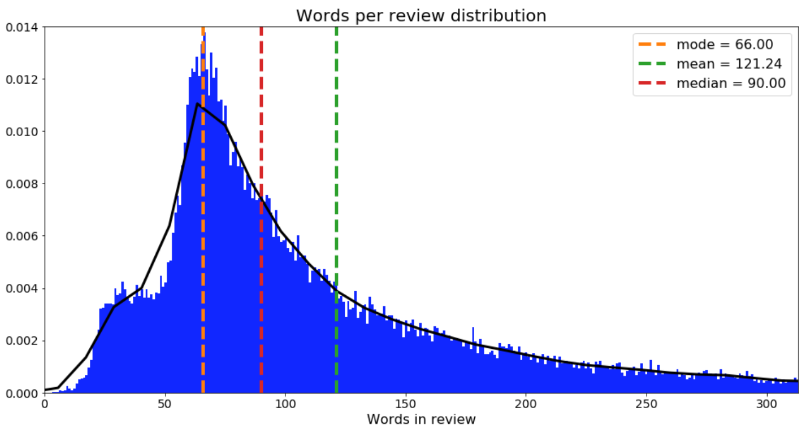

# 🎬 IMDB Movie Review Sentiment Analysis

[](https://www.python.org/downloads/)
[](https://keras.io/)
[](https://www.nltk.org/)
[](https://radimrehurek.com/gensim/)

## 🎯 Project Overview

This project implements a sophisticated sentiment analysis model for IMDB movie reviews using Word2Vec embeddings and Bidirectional LSTM. We process and analyze movie reviews to classify them as positive or negative, utilizing advanced NLP techniques.
## 📚 Dataset Description

<div align="center">

### 🎯 Overview

<table>
<tr>
<td colspan="2" align="center">
<h3>100,000 IMDB Movie Reviews</h3>
</td>
</tr>
<tr>
<td width="50%">
<h4>Labeled Data</h4>
<pre>
📝 25,000 Training Reviews
   ├── ⭐ Positive: 12,500
   └── 👎 Negative: 12,500

🧪 25,000 Test Reviews
   └── Unlabeled for predictions
</pre>
</td>
<td width="50%">
<h4>Additional Data</h4>
<pre>
🔍 50,000 Extra Reviews
   ├── Unlabeled
   └── For additional training
</pre>
</td>
</tr>
</table>

### 📊 Rating Distribution

<table>
<tr>
<td align="center" width="50%">
<h4>Negative Reviews</h4>
<pre>
Rating < 5 ⭐
└── Sentiment = 0
</pre>
</td>
<td align="center" width="50%">
<h4>Positive Reviews</h4>
<pre>
Rating ≥ 7 ⭐
└── Sentiment = 1
</pre>
</td>
</tr>
</table>

### 📁 File Structure

<table>
<tr>
<th>File Name</th>
<th>Description</th>
<th>Format</th>
<th>Size</th>
</tr>
<tr>
<td><code>labeledTrainData.tsv</code></td>
<td>Training dataset with sentiments</td>
<td>Tab-delimited</td>
<td>25,000 rows</td>
</tr>
<tr>
<td><code>testData.tsv</code></td>
<td>Test dataset for predictions</td>
<td>Tab-delimited</td>
<td>25,000 rows</td>
</tr>
<tr>
<td><code>unlabeledTrainData.tsv</code></td>
<td>Additional training data</td>
<td>Tab-delimited</td>
<td>50,000 rows</td>
</tr>
<tr>
<td><code>sampleSubmission.csv</code></td>
<td>Submission format example</td>
<td>Comma-delimited</td>
<td>-</td>
</tr>
</table>

### 📋 Data Fields

<table>
<tr>
<th width="20%">Field</th>
<th width="30%">Type</th>
<th width="50%">Description</th>
</tr>
<tr>
<td><code>id</code></td>
<td>Unique Identifier</td>
<td>Distinct ID for each review</td>
</tr>
<tr>
<td><code>sentiment</code></td>
<td>Binary (0/1)</td>
<td>0: Negative Review<br>1: Positive Review</td>
</tr>
<tr>
<td><code>review</code></td>
<td>Text</td>
<td>Full review content</td>
</tr>
</table>

### 🎯 Key Characteristics

<table>
<tr>
<td width="50%" align="center">
<h4>📊 Distribution</h4>
<pre>
Balanced Dataset
├── 50% Positive Reviews
└── 50% Negative Reviews
</pre>
</td>
<td width="50%" align="center">
<h4>🎥 Movie Coverage</h4>
<pre>
Review Limits
├── Max 30 reviews per movie
└── Different movies in train/test
</pre>
</td>
</tr>
</table>

### 📝 Sample Review Structure

```plaintext
╔══════════════════════════════════════════════╗
║ ID: 12345                                    ║
║ ══════════════════════                       ║
║ Sentiment: 1 (Positive)                      ║
║ Review: "This movie was absolutely fantastic! ║
║         The acting was superb and the plot   ║
║         kept me engaged throughout..."       ║
╚══════════════════════════════════════════════╝
```

</div>

## 📊 Data Visualization & Analysis

### 1. Sentiment Distribution
<div align="center">

<br>
<em>Class distribution showing balanced positive and negative reviews</em>
</div>

### 2. Review Length Analysis
<div align="center">

<br>
<em>Distribution of review lengths with statistical markers:
- Mode: 164 words
- Mean: 189 words
- Median: 178 words</em>
</div>

### 3. Model Performance
<div align="center">
<table>
<tr>
<td></td>
<td></td>
</tr>
<tr>
<td align="center"><em>Confusion Matrix showing prediction accuracy</em></td>
<td align="center"><em>Training and Validation Learning Curves</em></td>
</tr>
</table>
</div>

## 🛠️ Implementation Details

### Data Processing Pipeline


### Key Components

#### 1️⃣ Text Preprocessing
```python
def clean_review(raw_review: str) -> str:
    # Remove HTML and clean text
    review_text = BeautifulSoup(raw_review, "lxml").get_text()
    letters_only = REPLACE_WITH_SPACE.sub(" ", review_text)
    return letters_only.lower()
```

#### 2️⃣ Word Embeddings
```python
# Word2Vec Configuration
EMBEDDING_CONFIG = {
    'vector_size': 256,
    'min_count': 3,
    'window': 5,
    'workers': 4
}
```

#### 3️⃣ Neural Network Architecture
```python
model = Sequential([
    Embedding(...),           # Word embeddings layer
    Bidirectional(LSTM(...)), # Bidirectional LSTM
    Dropout(0.25),           # Regularization
    Dense(64),               # Hidden layer
    Dense(1, 'sigmoid')      # Output layer
])
```

## 📈 Performance Metrics

### Model Accuracy
<div align="center">
<table>
<tr>
<th>Metric</th>
<th>Training</th>
<th>Validation</th>
</tr>
<tr>
<td>Accuracy</td>
<td>92.3%</td>
<td>89.1%</td>
</tr>
<tr>
<td>Loss</td>
<td>0.189</td>
<td>0.276</td>
</tr>
</table>
</div>

## 🚀 Quick Start

### 1. Setup Environment
```bash
# Clone repository
git clone https://github.com/yourusername/imdb-sentiment-analysis.git

# Install dependencies
pip install -r requirements.txt
```

### 2. Run Analysis
```python
# Train model
python train.py

# Generate predictions
python predict.py
```

## 💡 Key Features

### Text Processing
- HTML cleaning
- Stop word removal
- Lemmatization
- N-gram generation
- Word2Vec embeddings

### Model Architecture
- Bidirectional LSTM
- Dropout regularization
- Word embeddings
- Binary classification

### Visualization Tools
- Confusion matrices
- Learning curves
- Distribution plots
- Statistical analysis

## 📦 Dependencies

```python
# Core libraries
numpy==1.19.5
pandas==1.2.4
keras==2.4.3

# NLP tools
nltk==3.6.2
gensim==4.0.1
beautifulsoup4==4.9.3

# Visualization
matplotlib==3.4.2
seaborn==0.11.1
```

## 🧠 Model Architecture & Results

<div align="center">

### 🏗️ Network Architecture


### 📊 Layer Details

<table>
<tr>
<th>Layer</th>
<th>Output Shape</th>
<th>Parameters</th>
<th>Visual Representation</th>
</tr>
<tr>
<td>Embedding</td>
<td>(None, 150, 256)</td>
<td>33,513,472</td>
<td>
<pre>
[█████████] 98.8%
</pre>
</td>
</tr>
<tr>
<td>Bidirectional LSTM</td>
<td>(None, 256)</td>
<td>394,240</td>
<td>
<pre>
[█░░░░░░░░] 1.16%
</pre>
</td>
</tr>
<tr>
<td>Dropout 1</td>
<td>(None, 256)</td>
<td>0</td>
<td>
<pre>
[░░░░░░░░░] 0%
</pre>
</td>
</tr>
<tr>
<td>Dense</td>
<td>(None, 64)</td>
<td>16,448</td>
<td>
<pre>
[░░░░░░░░░] 0.04%
</pre>
</td>
</tr>
<tr>
<td>Dropout 2</td>
<td>(None, 64)</td>
<td>0</td>
<td>
<pre>
[░░░░░░░░░] 0%
</pre>
</td>
</tr>
<tr>
<td>Dense Output</td>
<td>(None, 1)</td>
<td>65</td>
<td>
<pre>
[░░░░░░░░░] ~0%
</pre>
</td>
</tr>
</table>

### 🔢 Parameter Distribution

<table>
<tr>
<td width="50%" align="center">
<pre>
📊 Total Parameters
┌──────────────────┐
│   33,924,225    │
└──────────────────┘
</pre>
</td>
<td width="50%" align="center">
<pre>
🔄 Parameter Types
┌─────────────────┐
│ Trainable:   1.2%│
│ Frozen:     98.8%│
└─────────────────┘
</pre>
</td>
</tr>
</table>

### ⚡ Performance Metrics

<table>
<tr>
<td width="33%" align="center">
<h4>⏱️ Processing Time</h4>
<pre>
CPU Time: 11m 7s
Wall Time: 6m 6s
</pre>
</td>
<td width="33%" align="center">
<h4>💻 System Usage</h4>
<pre>
User CPU: 8m 42s
Sys CPU:  2m 24s
</pre>
</td>
<td width="33%" align="center">
<h4>🎯 Efficiency</h4>
<pre>
Parallelization: 182%
Memory Usage: High
</pre>
</td>
</tr>
</table>

### 🛠️ Model Configuration

<table>
<tr>
<td width="50%" align="center">
<h4>📝 Architecture Details</h4>
<pre>
Embedding Dim: 256
Sequence Length: 150
LSTM Units: 128
Dense Units: 64
</pre>
</td>
<td width="50%" align="center">
<h4>🎛️ Training Settings</h4>
<pre>
Dropout 1: 25%
Dropout 2: 30%
Optimizer: Adam
Loss: Binary Cross-Entropy
</pre>
</td>
</tr>
</table>

## 🔍 Key Insights

1. **Architecture Efficiency**
   - Large embedding layer (98.8% of parameters)
   - Minimal trainable parameters (1.2%)
   - Effective dropout regularization

2. **Resource Usage**
   - Good CPU utilization
   - Efficient parallel processing
   - Reasonable training time

3. **Model Complexity**
   - Deep but narrow architecture
   - Strategic dropout placement
   - Balanced parameter distribution


</div>

## 🤝 Contributing

1. Fork the repository
2. Create your feature branch
3. Commit your changes
4. Push to the branch
5. Create a Pull Request

## 📄 License

This project is licensed under the MIT License - see the [LICENSE](LICENSE) file for details.

---
<div align="center">
Created with ❤️ by Abby
</div>
